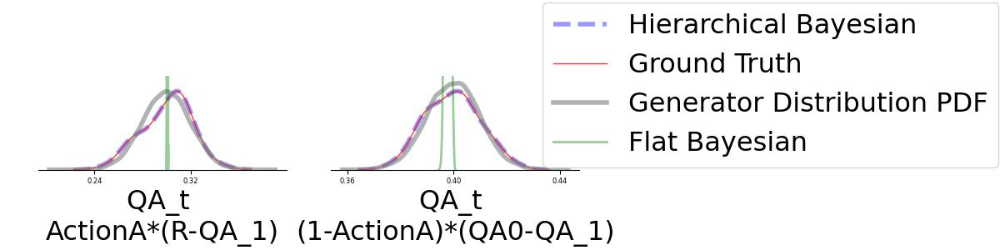
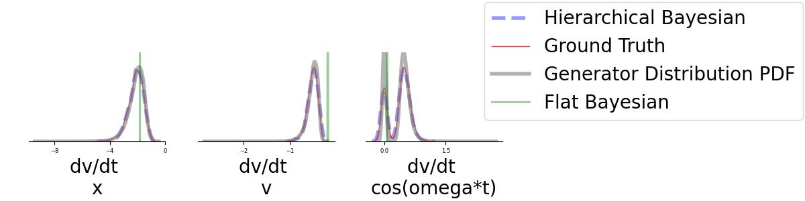
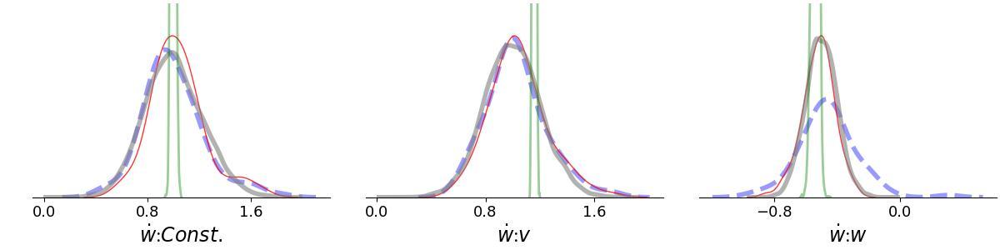
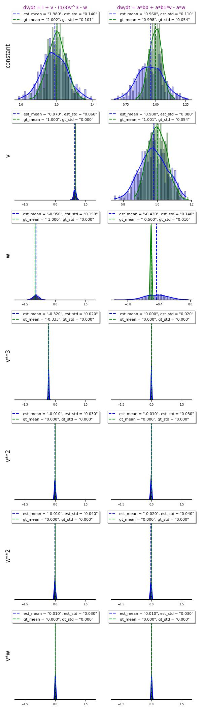

  

# Individual-Based Model Discovery with Hierarchical Bayesian SINDy   

## Abstract

Understanding individual differences in dynamical systems across experimental paradigms remains a fundamental challenge. Traditional modeling approaches often assume a fixed model structure, allowing for variations only in parameter values. However, the true underlying model may differ not only in parameter magnitudes but also in structure across observational conditions.

To address this limitation, we introduce a novel method that integrates **Bayesian hierarchical inference** with the **sparse identification of nonlinear dynamical systems (SINDy)**. This approach enables the discovery of distinct dynamical mechanisms within a wide range of individuals.

We applied this method to diverse dynamical systems, including those in environmental systems, physical systems, and cognitive science. Our approach infers a distribution over model structures while inducing sparsity, allowing us to identify shared and individual-specific mechanisms. The results show that key statistical properties of the synthesized data are accurately recovered, demonstrating the method’s promise in capturing structural differences in processes.

**Keywords**: Data driven model discovery, Hierarchical Bayesian model, Bayesian SINDy, Individual-based model.

---

## Introduction

A key application of AI in science is the development of data-driven methods for discovering the governing models of dynamical systems. One of the major challenges is accounting for differences between individuals, where an "individual" could be a human, a different environmental location, or a specific circuit. When considering these differences, it is necessary to move beyond a single, universal model.

Our work builds on the SINDy approach, a data-driven model discovery method that combines regression and sparsity. We specifically adopt a **Bayesian approach to SINDy**, which is especially useful when system dynamics are affected by noise. A Bayesian method allows us to find the true distributions of model parameters. To prevent the survival of unrelated terms, we induce sparsity by using an appropriate prior distribution, specifically the powerful **Horseshoe distribution**.

However, if a system's dynamics differ among individuals, the governing model itself should be a distribution, not just the mean of a noisy distribution. To achieve this, we use a **Hierarchical Bayesian model**. We apply the Horseshoe distribution as the prior for the mean of each candidate term's coefficient, which successfully induces sparsity. The following sections explain this method and its applications.

---

## Introduction of Methodology

Our approach first involves creating a library of candidate terms. The data, $X$, is structured across three axes: individuals, different candidate terms, and observation time series.

Using MCMC as an inference method, we recover the distribution of each coefficient in the library of candidate terms once the recovered samples are stationary. The Bayesian model has two levels: the coefficients of the candidate terms can differ along the individual axis. To induce sparsity, we set the Horseshoe distribution as the prior for the coefficient of each individual.

> 
>   
> **Figure 1**: Individual-based SINDy. (Top) A schematic process for deriving the posterior distribution of the model. (Bottom left) The structure of the Bayesian model. (Bottom right) The use case for the Lotka-Volterra dynamical system with results.

In some dynamical systems, the standard deviation of the time series for certain candidate terms can be large. In these cases, **scaling is crucial** for the MCMC algorithm to converge to a stationary state. The scaling affects the constant and factor coefficients differently.

Let's name the target as $y$, a candidate term as $x$, its coefficient as $a$, and the constant bias term as $c$. The scaling for individual $i$ using z-scaling is as follows:

$$
y_i = c_i + \sum_{j} a_i x_j
$$

After applying z-scaling ($x_{ij} = \frac{x_{ij}-\mu_{ij}}{\sigma_{ij}}$), the equation becomes:

$$
y_i = c_i + \sum_{j} a_{ij} \frac{x_{ij}-\mu_{ij}}{\sigma_{ij}}
$$

$$
y_i = (c_i + \sum_{j} a_{ij} \frac{\mu_{ij}}{\sigma_{ij}}) + \sum_{j} \frac{a_{ij}}{\sigma_{ij}} x_{j}
$$

Note that the scaling is computed on an individual basis. For example, in Z-scaling, the means and standard deviations are computed for the time series of each individual separately.

---

## Results

In this section, we show the implementation of this method on different dynamical systems under different conditions.

### Cognitive Reinforcement Learning

As the first example, we implemented this method on q-values from different synthetic participants in a cognitive two-bandit task experiment.

$$
Q_A[t]=Q_A[t-1]+\alpha(Action)(R-Q_A[t-1])+\gamma(1-Action)(Q0-Q_A[t-1])
$$

In this plot, the estimation of Bayesian Hierarchical, Simple Bayesian, and the ground truth are displayed by blue, pink, and green colors, respectively.  
### Damped Forced Harmonic Oscillator

As a second use case, we applied this method to data from a damped forced harmonic oscillator, governed by the equations:

$$
\dot{x}=v
$$

$$
\dot{v}=-\frac{k}{m}x-\frac{c}{m}v+\frac{F}{m}\cos{\omega t}
$$

The model was able to recover different structures per individual, even when the force was zero for some. This was achieved by recovering multimodal distributions for the corresponding coefficients.

### Fitz Hugh–Nagumo Model

We also implemented this method on data governed by the Fitz Hugh–Nagumo model. This system is a classic example studied by SINDy.

$$
\dot{v}=v-\frac{v^3}{3}-w-I
$$

$$
\dot{w}=a b_0 + a b_1 v-a w
$$
  

### Lotka Volterra

As another application, we used this approach to recover the dynamics of a predator-prey system with more than one prey or predator species.

$$
\dot{X}=\alpha X-\beta XY
$$

$$
\dot{Y}=\delta XY -\gamma Y
$$

---  

### RLC Circuit
As another application, we used this approach to recover the dynamics of an RLC circuit. The system is governed by the following equations:
  
$$
\dot{x}= v
$$  

$$
\dot{v}= -\frac{R}{L} v - \frac{1}{LC} x + \frac{1}{L} V(t)
$$  

This section demonstrates the method's ability to accurately identify the governing equations for an electrical system.

## Conclusions

In this research, we provided an approach for data-driven model discovery that accounts for individual differences in governing models. We applied the method to various systems, and the results show that it is capable of recovering not just the mean and standard deviation of coefficient distributions but also their shapes. This enables us to find non-shared or multi-modal structures within a population of individuals. Our approach empowers scientists to build models that can explain differences among individuals.

 

 
<table>
  <tr>
    <td width="20%" style="text-align: center; vertical-align: middle;"></td>
    <td width="20%" style="text-align: center; vertical-align: middle;"></td>
    <td width="20%" style="text-align: center; vertical-align: middle;"></td>
    <td width="20%" style="text-align: center; vertical-align: middle;"></td>
    <td width="20%" style="text-align: center; vertical-align: middle;"></td>
  </tr>
</table> 

> **Figure 2**: Implementation of the method on (a) cognitive reinforcement learning, (b) damped forced harmonic oscillator, (c) Fitz Hugh–Nagumo, (d) Lotka Volterra systems, and (e) RLC circuit.

---

## Acknowledgements

The calculations in this research were performed on a cluster funded by the **Deutsche Forschungsgemeinschaft (DFG, German Research Foundation)** under grant **456666331**.   
# Side Notes.
**Problem with Graphviz**  
If you have problem with ploting models, then :
For Windows:
For Windows:

Go to the official Graphviz download page.

Download the appropriate Windows installer (e.g., graphviz-x.x.x-win64.exe).

Run the installer. During the installation process, make sure to check the option to "Add Graphviz to the system PATH for all users" or a similar option. This will automatically handle the second step for you.
If still you have problem then:
Find the installation directory of Graphviz. It's usually something like C:\Program Files\Graphviz\bin.

Open the Start Menu and search for "Edit the system environment variables".

Click "Environment Variables...".

In the "System variables" section, find the Path variable and click "Edit...".

Click "New" and add the path to the Graphviz bin directory (e.g., C:\Program Files\Graphviz\bin).

Click OK on all the windows to save the changes.

Restart your command prompt or IDE for the changes to take effect.
